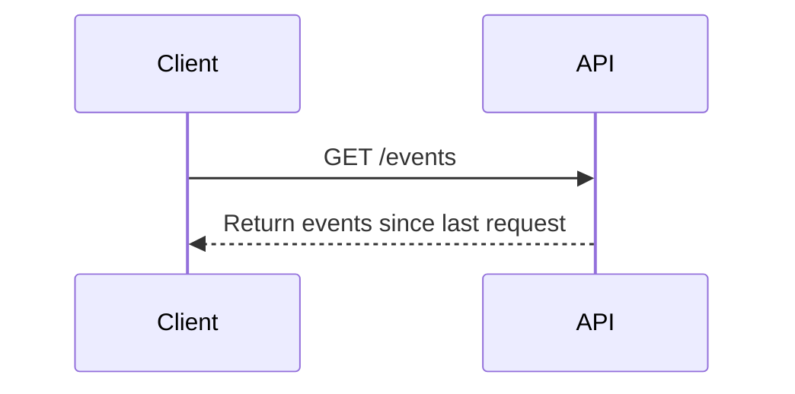
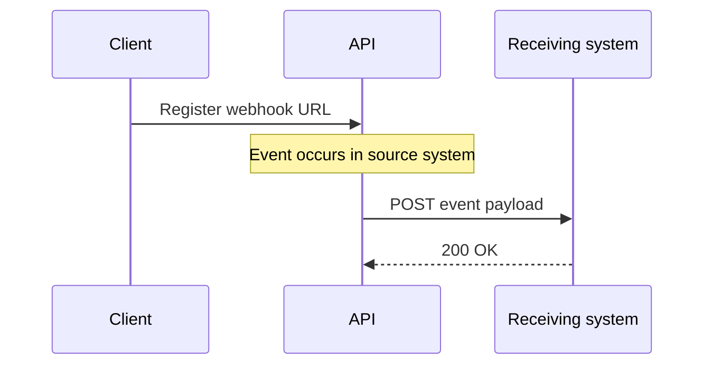

# Polling versus webhooks in API integrations

:::note About this sample
This article presents a conceptual explanation of polling and webhooks in API integrations. It is included here as a concept-writing sample focused on explaining technical tradeoffs, system behavior, and design decisions in a clear, structured way.
:::

## Overview

Integrations often need to respond when something happens in another application. For example, a recruiting platform might notify another system when a candidate submits an application, or a payment platform might trigger a workflow when a transaction is completed.

APIs usually expose a way for other systems to detect and process these events. Two common approaches are **polling** and **webhooks**.

With polling, the receiving system checks the API on a schedule to see whether anything new or updated is available. With webhooks, the API sends an HTTP request to a configured endpoint when an event occurs.

Both approaches solve the same basic problem, but they come with different tradeoffs. The main differences show up in data freshness, efficiency, reliability, and system complexity. Understanding those tradeoffs helps when deciding how an integration should receive events.

## How polling works

Polling is a model where a client repeatedly checks an API to determine whether new events or updates have occurred.

Typical flow:

The client performs this request at a defined interval, such as every minute, every five minutes, or once per hour. The response may include multiple events that occurred since the previous request.

Polling can be useful when events occur frequently or when systems need to process updates in batches. For example, an integration syncing customer relationship management (CRM) records into a data warehouse might retrieve all records updated since the last sync and process them together.

<!-- Notes / ideas to expand:

- polling intervals
- batch processing
- retrieving events since last checkpoint -->

## How webhooks work

Webhooks allow APIs to send notifications when specific events occur. Instead of repeatedly checking for updates, a client registers a webhook endpoint that can receive event notifications.

Typical flow:

Because webhooks push events as they occur, they enable systems to respond in near real-time.

Example events that might trigger webhooks include:

- candidate application submitted
- support ticket created
- payment processed
- account approved

<!-- Notes / ideas to expand:

- webhook registration
- event payloads
- near real-time workflows -->

## System design tradeoffs

### Data freshness

Polling retrieves updates based on a defined interval. This means there may be a delay between when an event occurs and when it's detected.

Webhooks deliver events when they occur, allowing integrations to react more quickly.

### Efficiency and API usage

Polling can generate many API requests that return no new data. If the polling interval is short, this may lead to unnecessary API traffic.

Webhooks avoid this problem by sending requests only when events occur.

### Event volume and batching

When events occur at high frequency, polling may allow systems to process multiple updates in batches rather than handling each event individually.

Example:

A system syncing Salesforce records into Snowflake might periodically request all records updated since the last sync rather than triggering an event for every record update.

### Infrastructure requirements

Webhooks require the receiving system to expose a publicly accessible endpoint that can receive HTTP requests.

Polling only requires the ability to call an API endpoint.

## Reliability and failure recovery

Webhook-based systems must consider how events are processed when they arrive. If an event fails during processing, the receiving system may need mechanisms to retry or replay the event.

Some platforms support retries or allow workflows to be re-run when failures occur.

Polling can sometimes recover more naturally from transient failures. If a polling cycle fails, the next cycle may still retrieve the same records depending on how the API exposes updated data.

<!-- Notes / ideas to expand:

- transient failures
- retry mechanisms
- idempotent processing -->

## Use cases

### Recruiting platform automation

A recruiting platform such as Greenhouse might send webhook events when a candidate submits an application or accepts an offer. These events can trigger downstream workflows such as sending notifications or updating internal systems.

### Data warehouse synchronization

Operational systems such as Salesforce often sync data into analytics platforms such as Snowflake. In these scenarios, you can use polling to periodically retrieve updated records and process them in batches.

## Choosing the right model

| Consideration    | Polling                     | Webhooks                    |
| ---------------- | --------------------------- | --------------------------- |
| Event delivery   | Client checks API           | API sends events            |
| Timing           | Interval-based              | Near real-time              |
| Efficiency       | May generate extra requests | Only triggered by events    |
| Infrastructure   | Simple                      | Requires endpoint           |
| Failure recovery | Often retry on next poll    | Depends on retries / replay |

## Conclusion

Polling and webhooks are both common approaches for delivering events between systems. The right approach depends on the requirements of the integration, including how quickly events must be processed, how frequently they occur, and how failures are handled.

In practice, many systems use a combination of both models depending on the type of data being processed and the operational constraints of the integration.

<!-- ## Notes for further expansion

Ideas to potentially add:

- architecture diagrams
- example webhook payload
- example polling API request
- discussion of push vs pull communication models -->
