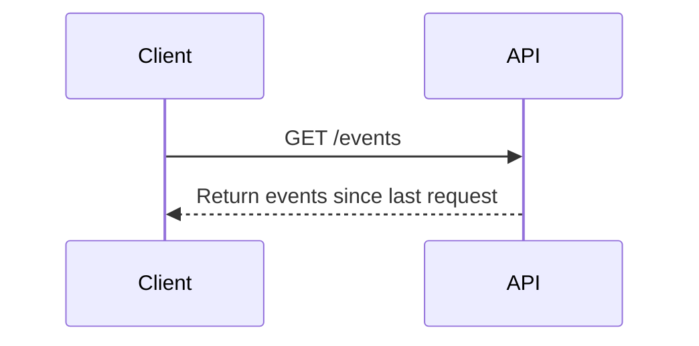
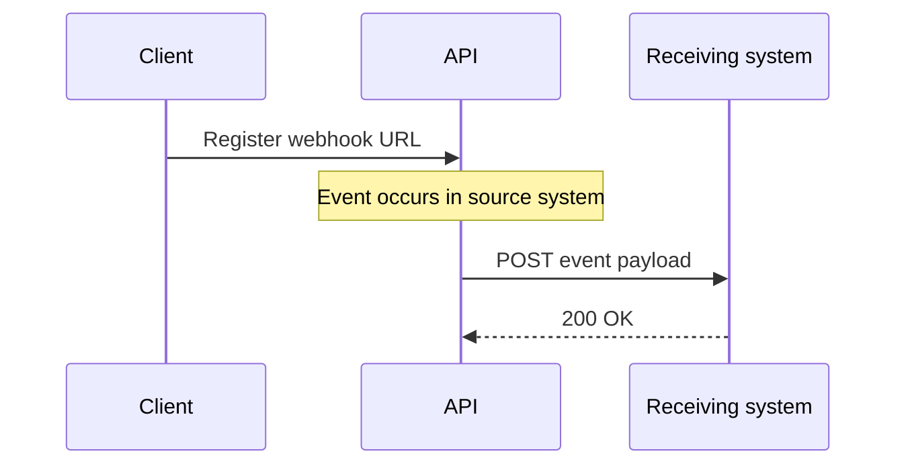

# Polling versus webhooks in API integrations

:::note About this sample
This article presents a conceptual explanation of polling and webhooks in API integrations. It is included here as a concept-writing sample focused on explaining technical tradeoffs, system behavior, and design decisions in a clear, structured way.
:::

## Overview

Integrations often need to respond when something happens in another application. For example, a recruiting platform might notify another system when a candidate submits an application, or a payment platform might trigger a workflow when a transaction is completed.

APIs usually expose a way for other systems to detect and process these events. Two common approaches are **polling** and **webhooks**.

With polling, the client checks the API on a schedule to see whether anything new or updated is available. With webhooks, the API sends an HTTP request to a configured endpoint when an event occurs.

Both approaches solve the same basic problem, but they come with different tradeoffs in data freshness, efficiency, reliability, and system complexity. Understanding those tradeoffs helps when deciding how an integration should receive events.

## How polling works

Polling is a model where a client repeatedly checks an API to determine whether new events or updates have occurred.

Typical flow:

The client performs this request at a defined interval, such as every minute, every five minutes, or once per hour. The response may include multiple events that occurred since the previous request.

Polling can be useful when events occur frequently or when systems need to process updates in batches. For example, an integration syncing customer relationship management (CRM) records into a data warehouse might retrieve all records updated since the last sync and process them together.

<!-- Notes / ideas to expand:

- polling intervals
- batch processing
- retrieving events since last checkpoint -->

## How webhooks work

Webhooks allow APIs to send notifications when specific events occur. Instead of repeatedly checking for updates, a client registers a webhook endpoint that can receive event notifications.

Typical flow:

Because webhooks push events as they occur, they enable systems to respond in near real-time.

Example events that might trigger webhooks include:

- candidate application submitted
- support ticket created
- payment processed
- account approved

<!-- Notes / ideas to expand:

- webhook registration
- event payloads
- near real-time workflows -->

## Comparing polling and webhooks

The following table summarizes the main differences between polling and webhooks across common integration considerations.

| Consideration | Polling | Webhooks |
| --- | --- | --- |
| Event delivery | The receiving system checks the API on a schedule. | The API sends an event when something happens. |
| Data freshness | Updates arrive based on the polling interval, so there may be a delay. | Updates are sent when the event occurs, so they are usually available sooner. |
| Efficiency and API usage | May generate repeated requests even when no new data is available. | Sends requests only when an event occurs. |
| Event volume and batching | Can work well for batch processing when many records need to be retrieved together. | Often handles events one at a time as they occur. |
| Infrastructure requirements | Only requires the ability to call an API endpoint. | Requires a reachable endpoint that can receive HTTP requests. |
| Reliability and failure recovery | A later polling cycle may still retrieve missed records, depending on the API design. | Often depends on retry behavior, replay support, or the receiving system's error handling. |
| Best fit | Scheduled syncs, batch updates, or systems with simpler infrastructure. | Near real-time automations and event-driven workflows. |

## Use cases

### Recruiting platform automation

A recruiting platform such as Greenhouse might send webhook events when a candidate submits an application or accepts an offer. These events can trigger downstream workflows such as sending notifications or updating internal systems.

### Data warehouse synchronization

Operational systems such as Salesforce often sync data into analytics platforms such as Snowflake. In these scenarios, you can use polling to periodically retrieve updated records and process them in batches.

## Conclusion

Polling and webhooks are both common approaches for delivering events between systems. The right approach depends on the requirements of the integration, including how quickly events must be processed, how frequently they occur, and how failures are handled.

In practice, many systems use a combination of both models depending on the type of data being processed and the operational constraints of the integration.

<!-- ## Notes for further expansion

Ideas to potentially add:

- architecture diagrams
- example webhook payload
- example polling API request
- discussion of push vs pull communication models -->
